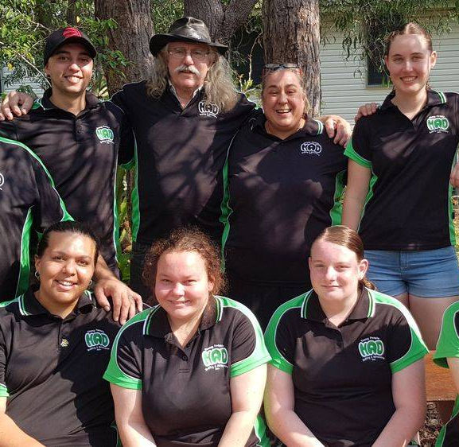
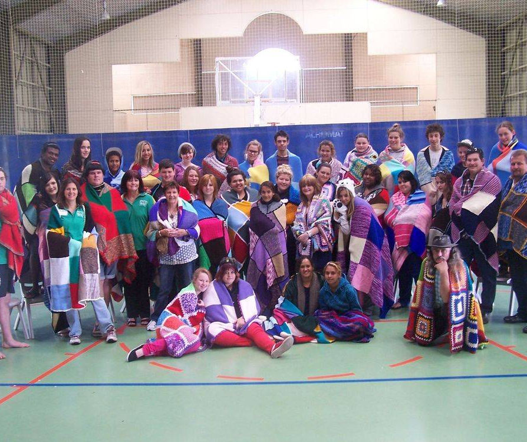
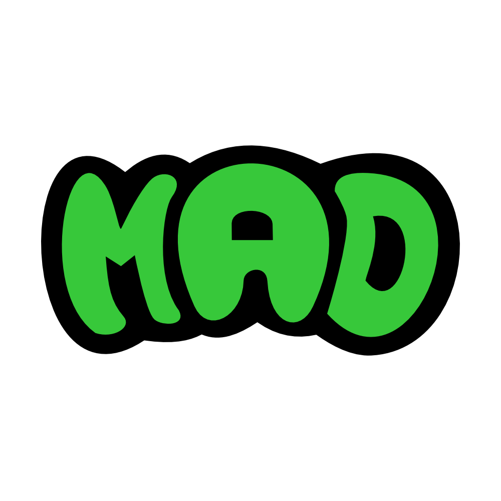
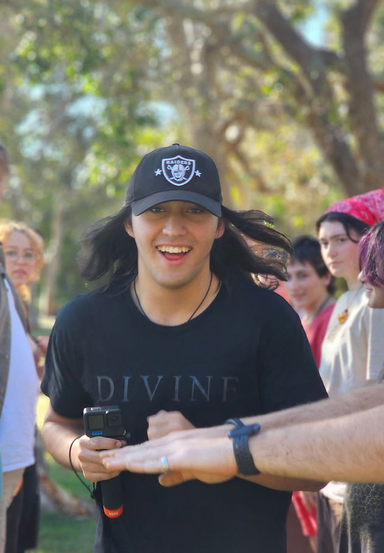
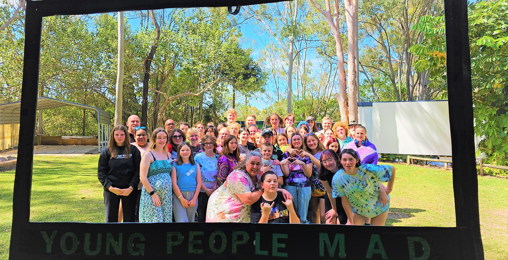

## Where we started

In 2012 a group of young people and adults met to discuss the support services available for young people at the time. Through discussions, it was found that a large percentage of young people weren’t responding to the services being offered. The group met on multiple occasions to discuss what they could do to be able to provide young people with the support they needed, in a way they would respond. The group discussed the challenges that young people face, the issues that affect them, and how they could be the change. Armed with the information from these discussions they were able to build the MAD program, with the aim of having the program for young people by young people. Fast forward to today, MAD has continued to stick with the same vision, having the program evolve based on feedback and suggestions from young people.

---

## Our First Program

Our pilot program was held from the 17th – 19th of August 2012, at the Yeppoon Activity and Recreation Centre. We had young people attend from all over Queensland sharing stories of their journey through life. This pilot was proved to be a successful start, to something that will be significant for young people across Queensland. This pilot helped build the foundation of the program we run today.

---

<h2>Our Goals</h2>

- To provide a safe environment for all young people.
- To keep our program current so that it caters to the young people's needs.
- To not only support young people in our programs but to provide an ongoing support system.
- To one day obtain funding to provide a free program to the young people of Australia.

---



---

## Our Success

We strive to make a safe space where all those who attend camp can feel comfortable and accepted. Creating this safe atmosphere enables the young people to feel they can open up in front of a large group and share some of the most extreme issues they have faced. Our statistics show that since 2012, on average 97% of young people who attended have found our program helpful and a majority made huge improvements to their lives after a single camp. Currently, we have groups attending from the Isis, Bundaberg, Gin Gin, Gladstone, and Rockhampton regions but are slowly expanding. With our outlook being by young people, for young people, this means that the team that runs programs all started out as a participant themselves. This helps keep the topics covered at MAD fresh, and current and also helped us win the Queensland Child Safety Award for “Youth Participation” in 2015.

---

## MAD Program

MAD programs run from Friday afternoon to Sunday afternoon. The program is run over this period to give the young people the chance to feel safe and secure within the MAD environment. It is important that this time is given to the young people so they can build trust in each other, this begins the foundations of building a support system. Over the weekend issues of self-discovery are covered, such as effective communication, trust, self-esteem goal setting, family matters, addictions, suicide awareness along with many other topics of concern. The majority of the sessions and topics are now covered by our Young Leaders. All young participants that attend MAD are linked with a support adult who starts as the primary supporter, although by the end of the weekend, you have a huge support team to lean on.

---

