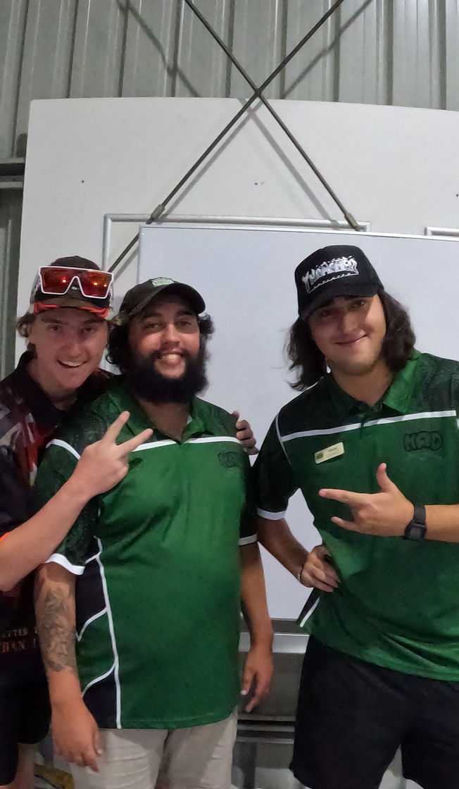
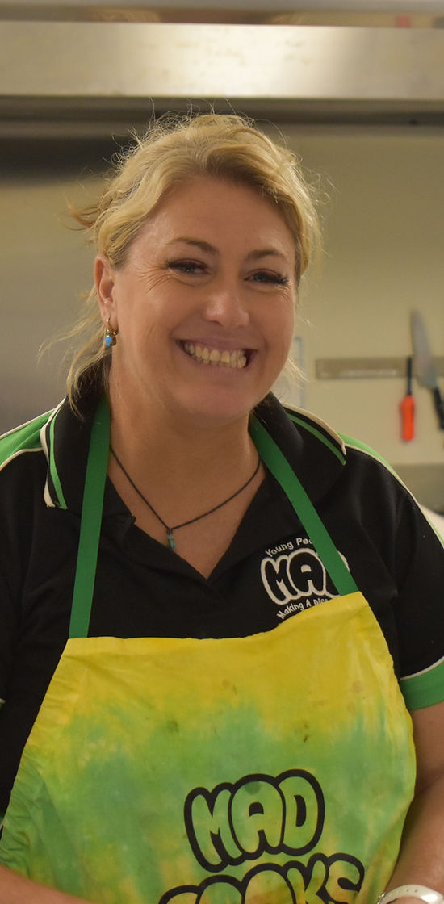
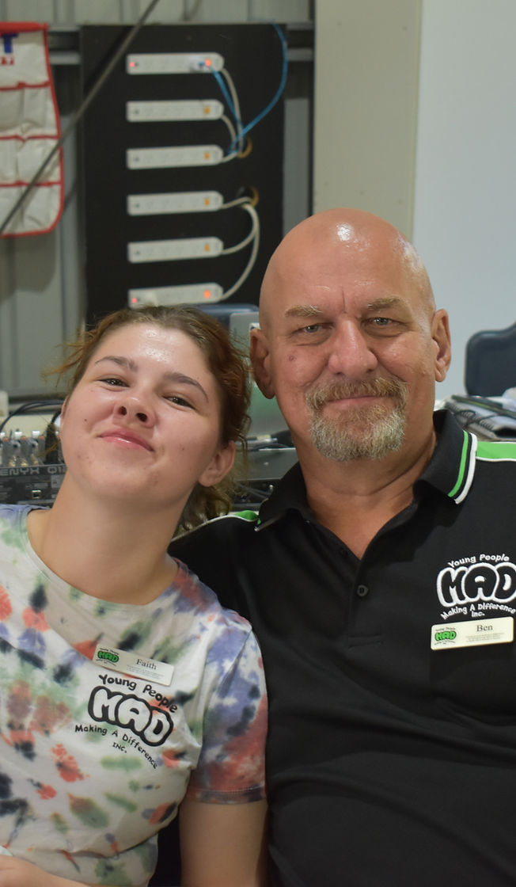
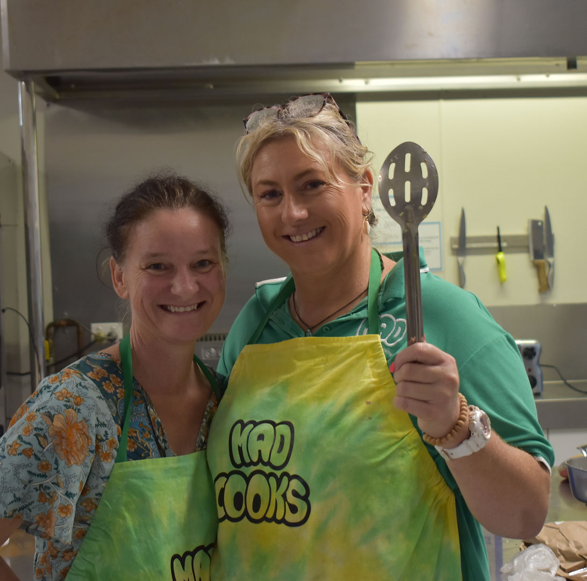


  
  
  


## MEET OUR TEAM!

Support Adults, Senior Leaders, Leaders, and Trainee Leaders, our team is made up a great group of people all with their own lived experience.  Some of our Support Adults even started as participants at a MAD camp, keeping to our theme of for young people, by young people.

## Trainee Leaders

Our trainee leaders are our most recent group to complete our Leaders Training a 5 day camp where they learn the skills to become leaders.


 

 

 

 

 


## Graduated/Senior Leaders

Our graduated and senior leaders have been here the longest, with a few of them attending the very first MAD Camp in 2012. Together they form a sub-committee that has final say on all changes for the program.


 

 

 

 

 


## Adult Leaders

Our support adults are the back-bone of our program, not only do they bring young people to attend camps, they also provide support outside of camps. They work with our young people every day to help them overcome their past, and build a bright future.


 

 

 

 

 


---

# And most important!
## Our amazing MAD Cooks!

Shellie, Pieta and Tim spend countless hours to make  sure no young person goes hungry while at camp